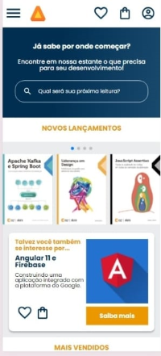

<h1 style="text-align: center">Alura Book</h1>
<h2> 📰 Sobre</h2>

Projeto da Alura do curso de HTML e CSS: responsividade com mobile-first.

É um número muito grande, são muitas pessoas que acessam a internet por meio de celulares, tablets, dispositivos que podem levar na bolsa.

Em 2015, o Google já priorizava em seu buscador sites que se adaptassem a diversos tamanhos de tela, sites responsivos. Então, buscando abranger todo tipo 
  de pessoa usuária e querendo um lugar melhor na busca, que tipo de abordagem podemos utilizar para facilitar isso e ajudar no desenvolvimento.

<h2> 🚀 Tecnologias</h2>

<h2> 📞 Contato</h2>

 
  
  
   
  
  

  

    <h2>Link do Projeto</h2>
    <a href="https://misael1981.github.io/Alura-Book/">Clique e confira</a>
    
  

